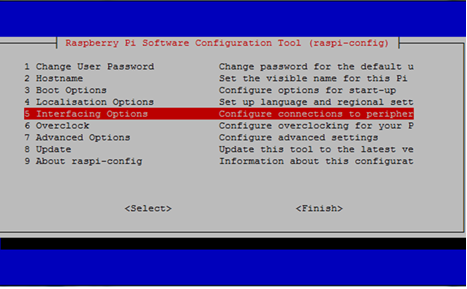
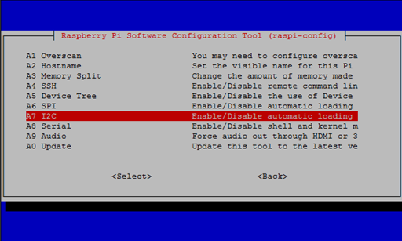
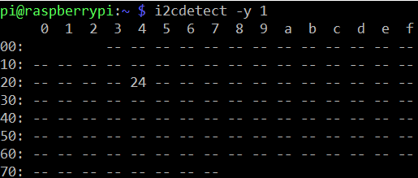
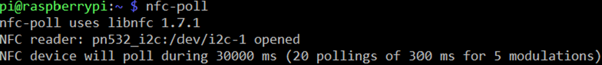

# Rpi_NFC_Door_Open
This is Raspberry script for opening door(need to write up) with simple Database and Web aplication

This project is focused for registration by NFC (Near Field Communication). It's just base for normal aplication which can be used in Work or School.

For this project i used Raspberry Pi version 3B with NFC PN532 reader
I am sure it will work on Rpi 2 and Rpi 1 but if it have I2C Bus

----------------------------------------------Configuration I2C to use on Rpi----------------------------------------------------

First you need go to Raspberry config
in terminal and type:
```console
pi@raspbery:~ $ sudo raspi-config
```
You wil get table with configuration



Go to advance options



And make it Enable
Now go out with combination ctrl + c
------------------------------------------Now we set up raspi to comunication with NFC board---------------------------------------
Open terminal and type to install Packages:
```console
pi@raspbery:~ $ sudo apt-get update
pi@raspbery:~ $ sudo apt-get install libusb-dev libpcsclite-dev i2c-tools
```
Download and unpack

```console
pi@raspbery:~ $ cd ~
pi@raspbery:~ $ wget http://dl.bintray.com/nfc-tools/sources/libnfc-1.7.1.tar.bz2 tar -xf libnfc-1.7.1.tar.bz2
```
Compile and install
```console
pi@raspbery:~ $ cd libnfc-1.7.1
pi@raspbery:~ $ ./configure --prefix=/usr --sysconfdir=/etc make
pi@raspbery:~ $ sudo make install
```
Now make libnfc.conf 
```console
pi@raspbery:~ $ cd /etc
pi@raspbery:~ $ sudo mkdir nfc
pi@raspbery:~ $ sudo nano /etc/nfc/libnfc.conf
```
and insert this
```
# Allow device auto-detection (default: true)
# Note: if this auto-detection is disabled, user has to set manually a device
# configuration using file or environment variable
allow_autoscan = true

# Allow intrusive auto-detection (default: false)
# Warning: intrusive auto-detection can seriously disturb other devices
# This option is not recommended, user should prefer to add manually his device.
allow_intrusive_scan = false

# Set log level (default: error)
# Valid log levels are (in order of verbosity): 0 (none), 1 (error), 2 (info), 3 (debug)
# Note: if you compiled with --enable-debug option, the default log level is "debug"
log_level = 1

# Manually set default device (no default)
# To set a default device, you must set both name and connstring for your device
# Note: if autoscan is enabled, default device will be the first device available in device list.
#device.name = "_PN532_SPI"
#device.connstring = "pn532_spi:/dev/spidev0.0:500000"
device.name = "_PN532_I2c"
device.connstring = "pn532_i2c:/dev/i2c-1"

```
On PN532 switches set  

SEL0 H

SEL1 L

Now type :
```console
pi@raspbery:~ $ i2cdetect -y 1
```
And you will get something like this

w

If this come out test NFC to reading some card
Type into console:
```console
pi@raspbery:~ $ nfc/poll
```
You will get this lines



